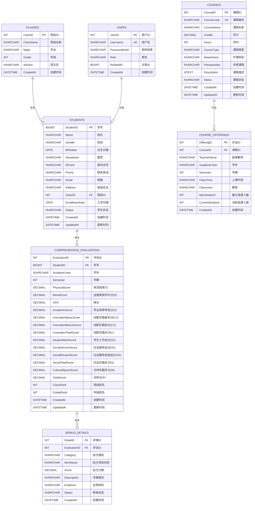
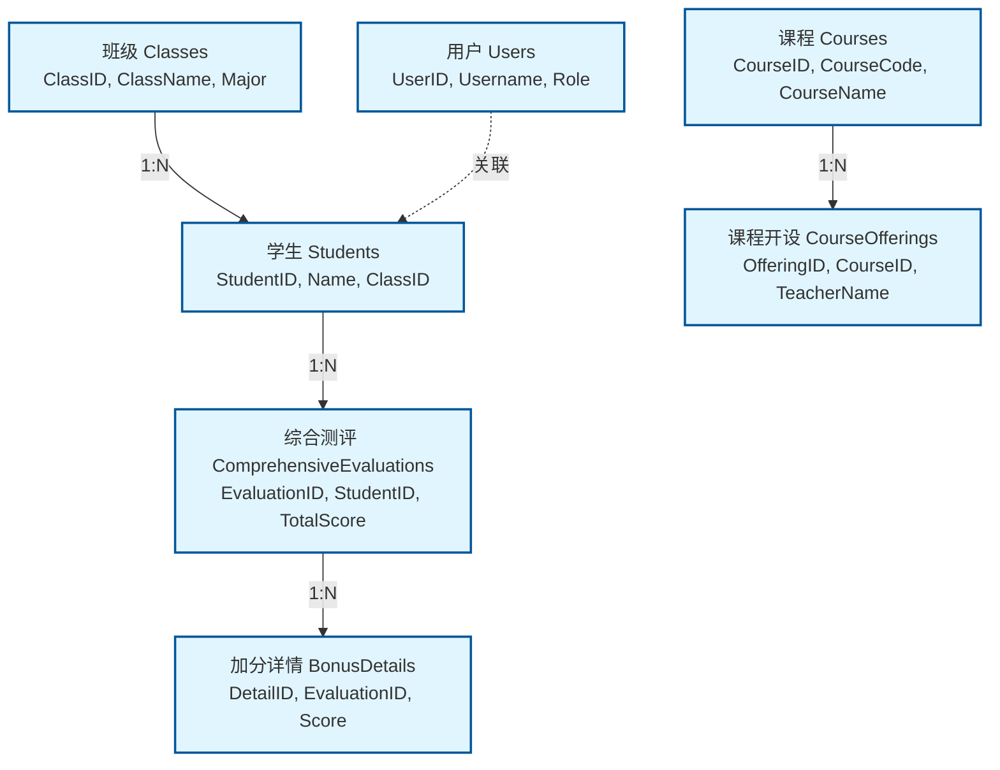
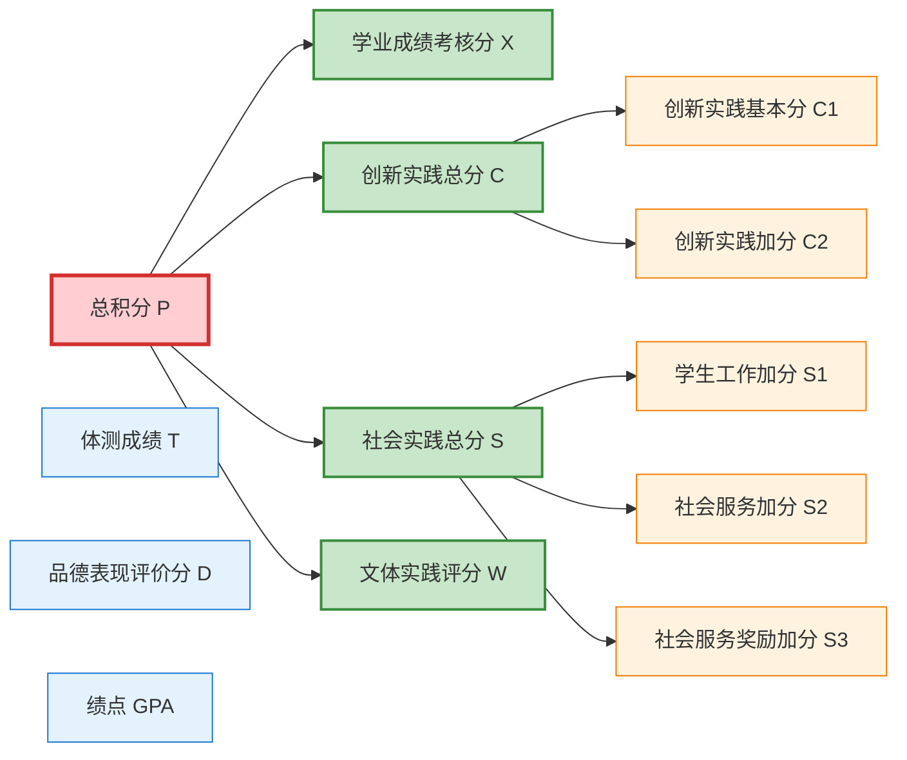
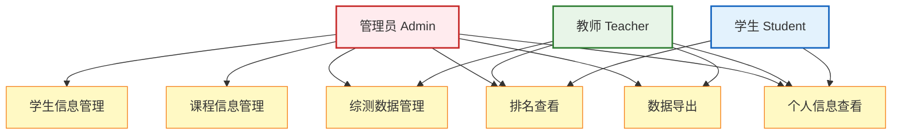
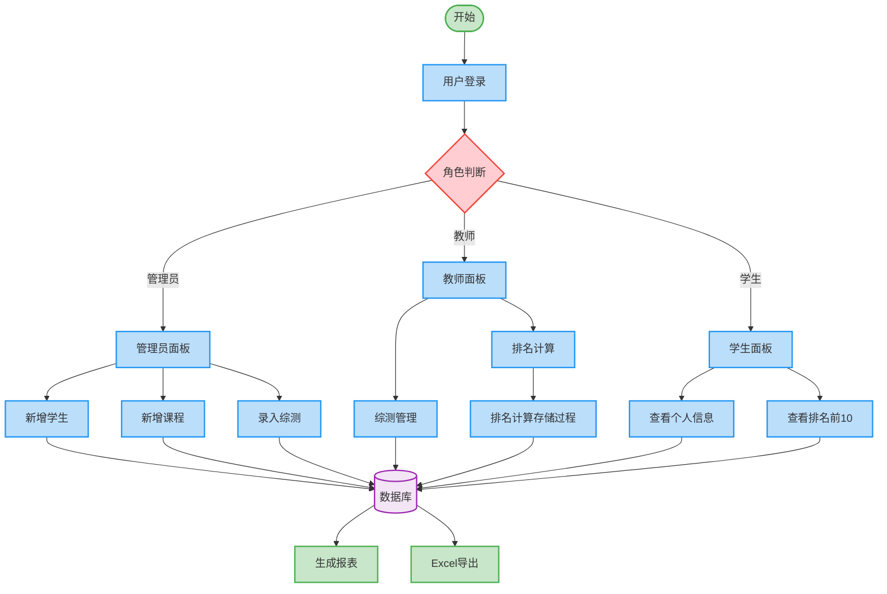

# 大数据2班管理系统 - 可视化ER图

## 实体关系图 (使用Mermaid语法)

## 数据库关系图 (简化版)

## 综合测评评分体系图

## 用户权限关系图

## 数据流程图

---

**使用说明**:
1. 将以上Mermaid代码复制到支持Mermaid的工具中查看图形化效果
2. 推荐工具: GitHub、GitLab、Typora、VS Code (Mermaid插件)、在线Mermaid编辑器
3. 这些图表可以直接用于答辩PPT中